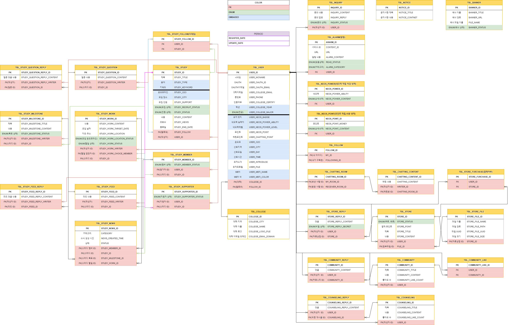

# NEOS
- 대학생 스터디 모집 커뮤니티 플랫폼

# 프로젝트 목적
대학생들을 위한 스터디 모집 
관심 분야의 전공 등 서로의 공부법을 공유 
대학생뿐만 아니라 일반 중고등학생도 평소에 관심있는 학과에
대해 정보를 받을수 있으며 자료를 사고파는 자료상점도 이용가능
일반 커뮤니티와 자신의 고민상담을 올릴수있는 익명 고민상담 서비스를
운영 하고있으며 서로의 부족했던 부분을 채워줄수 있는 
웹 서비스 입니다.

# 구현 기술 스택 
- JDK 11.0.15
- Oracle (11g)
- Jpa
- SpringBoot 2.7.5
- Thymeleaf
- HTML, CSS, JS
- JQuery 3.6
- QueryDsl 5.0
- AJAX
- WebSocket
- Quartz
- OAuth 2.0 Naver/Kakao/Google
- KakaoMap api
- Summernote api 
- BootPay api
- Gmail api
 
# 테스트 환경
- Junit 5.0
- Postman
# Dependency
- Gradle

# 프로젝트에서 맡은 역할
- 메인 서비스 전체
- 문의하기 서비스 전체 
- 모집하기 서비스 전체
- 프로필 상세 서비스 전체 

# ERD

# 느낀 점 
- JSP때 보다는 개발속도 편리성이 더 좋았으며 
테이블과 서비스도 JSP때 보단 더 많았지만 
서비스를 다 구현 했다는 점에서 뿌듯했다
아직은 더 부족함을 느끼면서 더더욱 열심히 하겠다는 
생각을 하게되었던 프로젝트였다.